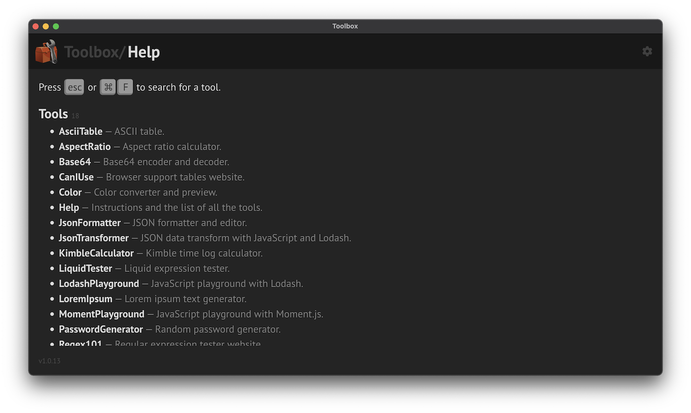
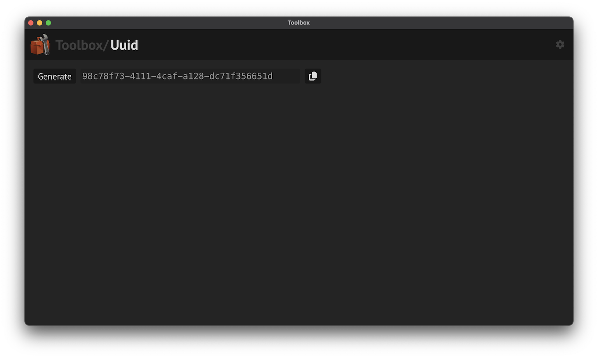

# Toolbox

Collection of my small development tools bundled in an Electron app.

My tools are probably not that useful for others, but the project itself might be a good starting point to build your own toolbox.

## Tools

There are only a few tools at the moment. I will add new tools incrementally.

## Platform

Usually, when I make small tools for myself, it's not worth the time to polish them, or create reusable components to make a consistent look&feel.

But since I plan to add a lot of tools to this toolbox, I've spent the time creating kind of a platform for them. This makes it easy to add new tools, make their UIs consistent, generalise often needed functionalities, etc. It also contains base components for classes of tools, like generators, analyzers, formatters, playgrounds, websites.

## Main scripts

- `npm start` - Start development in Electron with dev server.
- `npm run make` - Build production MacOS app. Output: `out/Toolbox-darwin-arm64/Toolbox.app`.

## Changing the port

- Set the new port parameter of `WebpackPlugin` in `forge.config.ts`.

## Changing the icon

- Put the new icon to `_work/icon.png` in 1024x1024 resolution, then `npm run generate-app-icon`.

## Changing the CSP policy

- If you need to change the default CSP policy, see `devContentSecurityPolicy` in `forge.config.ts`.

## Screenshots

