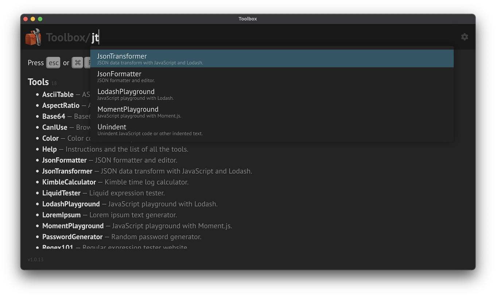
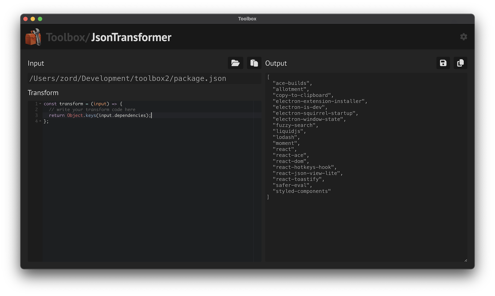
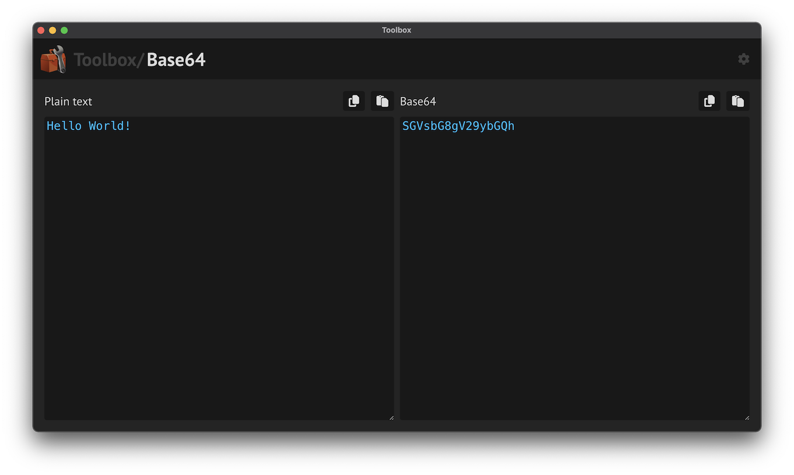
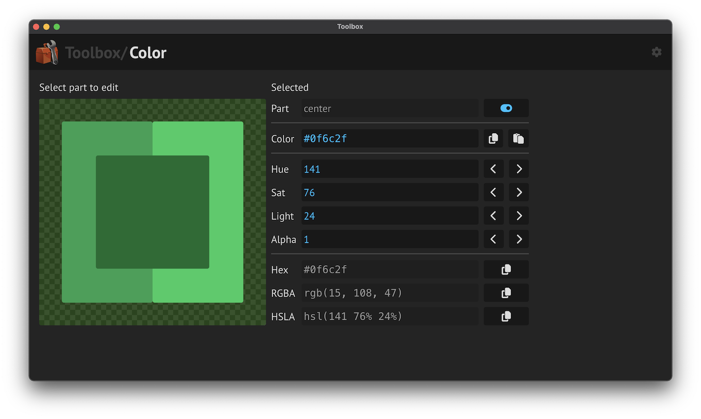
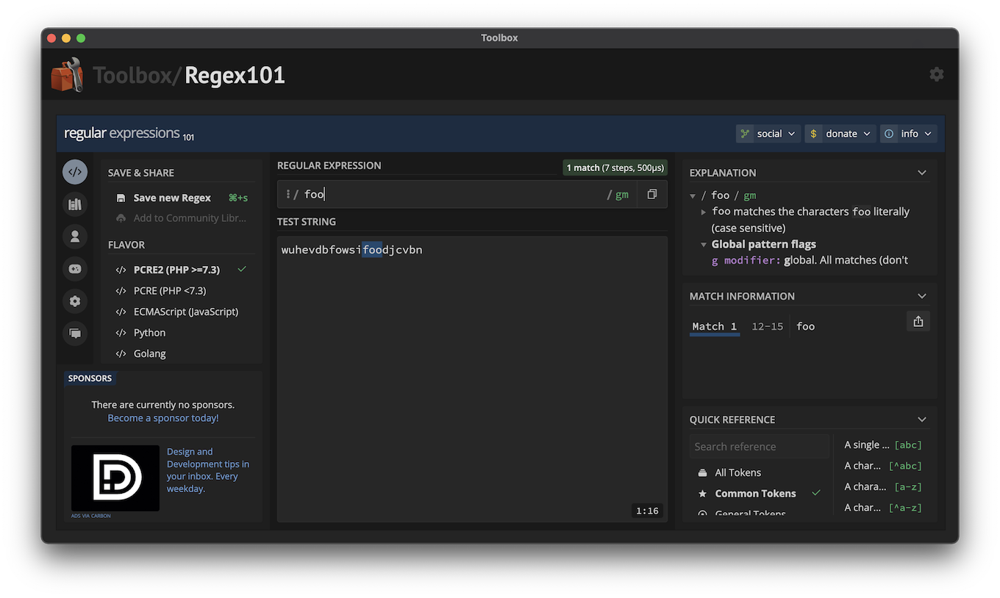

# Toolbox

Collection of my small development tools bundled in an Electron app.

Probably not all of my tools are useful for everyone. Maybe you can reuse some. Or at the very least, the project itself might be a good starting point to build your own toolbox.

## Tools

There are quite a few tools already, but I will keep adding new tools incrementally.

## Platform

Usually, when I make small tools for myself, it's not worth the time to polish them, or create reusable components to make a consistent look&feel.

But since I plan to add a lot of tools to this toolbox, I've spent the time to create kind of a platform for them:

- Easy to add new tools.
- Consistent UI and behaviours.
- Persistent states across app restarts.
- Generalised settings handling.
- Reusable templates for tool types: analyzers, formatters, playgrounds, websites.

## Main scripts

- `npm start` - Start development in Electron with dev server.
- `npm run make` - Build production MacOS app. Output: `out/Toolbox-darwin-arm64/Toolbox.app`.

## Customizations

If you fork this to build your own toolbox, you might want to change some things.

- Change the port: Set the `port` parameter of the `WebpackPlugin` in `forge.config.ts`.
- Change the icon: Replace `_work/icon.png` with the new icon, in 1024x1024 resolution, then `npm run generate-app-icon`.
- Change the CSP policy: Set `devContentSecurityPolicy` in `forge.config.ts`.

## Screenshots

